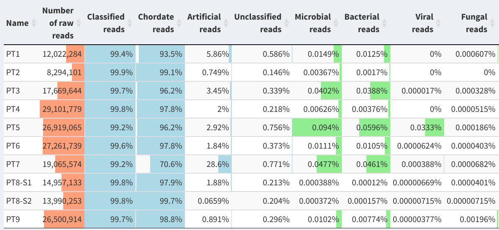
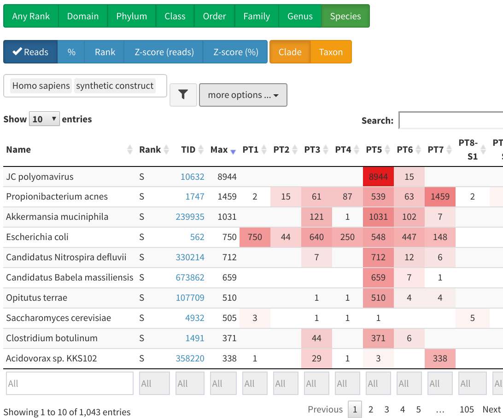

# Pavian Metagenomics Data Explorer

Pavian is an interactive web tool for analyzing metagenomics data for microbiome and infectious disease studies. This document provides a walkthrough through the interface to explore, analyze and visualize data. 

## 1) Data Input - Import Kraken and Centrifuge report files
The first step is loading data. Pavian currently supports results from Kraken [@DWood_SSalzberg2014-GB], KrakenUniq [@FBreitwieser_SSalzberg2018-GB], Centrifuge [@DKim_SSalzber2016-Biorxiv] and MetaPhlAn [@DTruong_NSegata2015]. Contributions to support additional formats are very welcome. Select the 'Data Input' tab and upload files through the interface. The uploaded files will be added to a sample set with an auto-generated name, which can be changed later on. 

In this walk-through we use data from @SSalzberg_CPardo2016-NNN that's part of the Pavian distribution. To load this dataset, click the 'Load example data' button. The raw report files are also available for [direct download](https://github.com/fbreitwieser/pavian/tree/master/inst/shinyapp/example-data/brain-biopsies).

## 2) Results overview of identification across samples

### Brain biopsies data
@SSalzberg_CPardo2016-NNN used sequencing to detect the presence of pathogenic microbes in brain or spinal cord biopsies from 10 patients with neurological problems indicating possible infection, but for whom conventional clinical and microbiology studies yielded negative or inconclusive results. 

Each sample is from a diseased patient (PT1 - PT10). There are no healthy controls, and for all but one patient (PT8) there is only one sample available. The patients had different diseases; thus it was not expected that the same bug was the cause in the patients. The samples are their own control - ubiquitously present microbes probably are sequencing or laboratory contaminants. The FASTQ files for this study are available at http://www.ncbi.nlm.nih.gov/bioproject/PRJNA314149. The reads were classified with Kraken.

Select 'Results Overview' in the sidebar to see an overview of the classifications across the samples (see Figure 2). These samples have between 8.3 and 29 million reads, most of them classified as human. There is a varying number of reads classified as artificial - usually below 5%, but two outliers in sample PT1 and PT7 with 5.9 and 29%, respectively. The number of reads classified as microbial is below .1% in all samples.

## 3) Comparing the classifications across samples

The 'Comparison' tab allows to delve deeper into the data (see Figure 3). By default, all classifications at all taxonomic ranks are shown, but usually viewing identifications at species, genus or phylum level is more insightful. In addition to the raw reads, the table can additionally show percentages, z-scores and ranks. For configuring the statistics and showing additional summary columns (mean, median, standard deviation, etc), select 'More options'. Since often the host dominates the sample, the filtering textbox can be used to remove various taxa from the view.

After selecting species identifications and ordering by the maxium number of reads, we can easily see a outlier identification in one of the brain biopsies samples. In PT5, a substantial number of reads map to JC polyomavirus.

## 4) Having an overview of all identifications in a single sample with the Sankey diagram

As JC Polyomavirus is a prime suspect in sample PT5, let's look further into the sample. Select 'Sample' in the sidebar, and then 'PT5' (Figure 5).

## 5) Alignment viewer - Zoom into one pathogen in one sample 

We confirmed that JC polyomavirus has a high read count in sample PT5. However, do these reads cover the genome, or are they localized in a limited stretch of the genome? The coverage of the genome can provide a strong indication whether an assignment is spurious or not. A high read count for a particular species does not always mean that the microbe is present, as the reads may map to low-complexity or contaminated sequences.

Click 'Alignment viewer' to get to Pavian's two functionalities to help in this investigation. First, an interface to access the NCBI RefSeq and GenBank assemblies [@PKitts_AKimchi2016-NAR] ('Download genomes for alignment'). There, go to 'viral' genome assemblies, and select 'Get assembly info'. Note that the associated assembly information is downloaded from NCBI in the background. Search for 'JC Pol' to find the reference genome for this species (see Figure 6). Note that the reference genome is the strain Mad1 originally uploaded in 1993. Once a row in the table is selected, a link to the genomic sequence (*_genomic.fna.gz) is displayed below, as well as command-line commands to download and build an index based on the genome. Note that Pavian does not provide any alignment funcationality, but this has to be done separately using aligners such as bowtie 2 or bwa mem.

With a BAM file and BAM index (BAI) available, we can use the genome viewer. Click 'View alignment'. Normally, the two files have to be uploaded by clicking the 'Browse' button. Pavian includes the alignment of the sequences of PT5 to the reference genome of JC polyomavirus. Those can be loaded by clicking 'Load example data' (you may have to install Rsamtools first). Upon loading the files, the coverage over the genome is displayed (Figure 7). You can select a region to zoom into. For this genome we see that the reads align pretty randomly across the genome, but certain small region are not covered. As the reference genome is a strain that was isolated in 1993, it is very likely that this patient does have a different strain. Still, the coverage of this genome provides confidence that it is the same species.

## References

